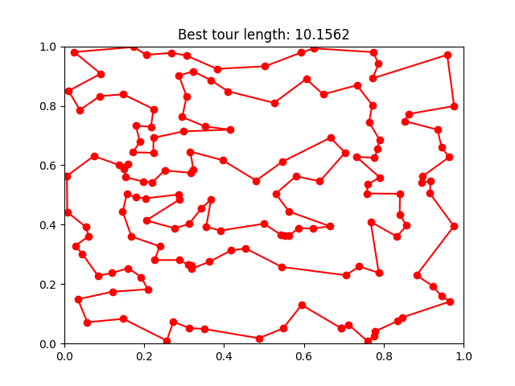
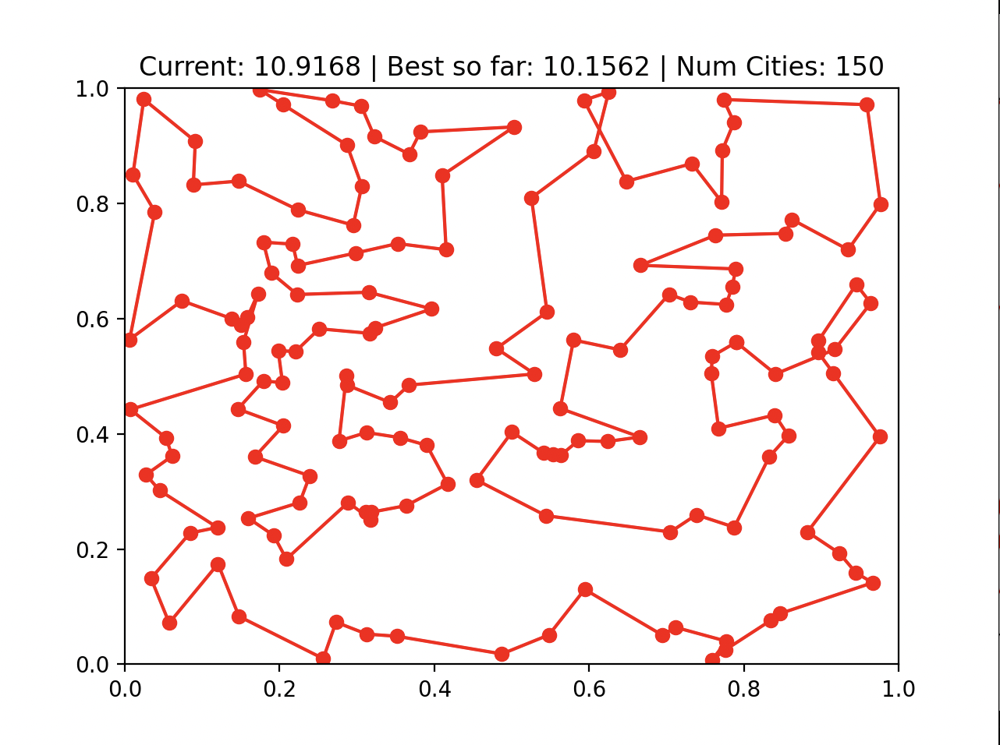
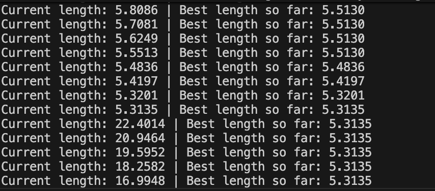
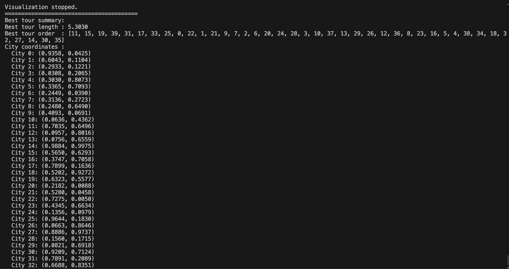

# Anytime TSP Solver (Python)

An Anytime Algorithm for the Traveling Salesman Problem using Best-Improvement 2-Opt

## Overview

This project is a simple, educational implementation of an anytime algorithm for the Traveling Salesman Problem (TSP).  
An anytime algorithm returns a valid solution quickly, then continues improving the solution as long as it keeps running.

This implementation uses:

- Random initial tour
- Best-improvement 2-opt local search
- A generator-based anytime solver
- Live Matplotlib visualization

The solver repeatedly yields better solutions over time until no further improvements can be found, and you can stop it at any point — the best known solution is always available.

## Key Concepts

### Anytime Algorithm

An algorithm that:

1. Produces a valid solution at any moment  
2. Improves the solution over time  
3. Continues until manually stopped  

This project demonstrates the concept using TSP.

### 2-Opt

2-opt is a local search heuristic that improves a TSP tour by:

1. Selecting two indices `(i, j)` in the tour  
2. Reversing the segment between them  
3. Keeping the swap only if it improves the overall tour length  

The algorithm evaluates all possible swaps and chooses the best improvement.

## Project Structure

```text
anytime_tsp/
│
├── data/
│   └── sample_points.json        # optional data file
│
├── tsp/
│   ├── __init__.py
│   ├── geometry.py               # distances, tour length
│   ├── tour.py                   # tour utilities & 2-opt swap
│   ├── two_opt.py                # best-improvement try_two_opt()
│   └── anytime_solver.py         # generator-based anytime algorithm
│
├── main.py                       # runs solver + live visualization
└── README.md                     
```

## How to Run

1. Install Requirements

```bash
pip install -r requirements.txt
```

2. Run the Main Script

```bash
python main.py
```

## What happens when you run it

- A set of random points is generated.
- A random tour is created and visualized.
- The anytime solver begins improving the tour.
- The plot updates whenever an improvement is found.
- Current best length prints to the console.
- Close the plot window or press Ctrl+C to stop.

## Live Visualization

The plot window shows:

- The current tour drawn through all points
- Automatically updating as 2-opt finds improvements
- Length displayed in the title
- Continues until stopped manually

This demonstrates anytime optimization whereimprovements are visible in real time.

## Core Components

### try_two_opt(tour, points)

Best-improvement 2-opt function:

- Tries every possible segment reversal
- Keeps the best improved tour
- Returns (new_tour, new_length) if improvement exists
- Returns None if no improvement

### anytime_tsp(points)

Generator function:

- Yields the initial random solution
- Repeatedly tries 2-opt
- Yields better solutions as soon as they appear
- Runs forever (or until stopped)
- Tracks the best known solution so far
- Restarts after reaching a local optimum

### main.py

- Generates dataset
- Starts solver
- Prints progress
- Shows live Matplotlib animation
- Stops cleanly on window close or Ctrl+C

## Screenshots

### Best Tour Recorded During Execution




### Example Running Outputs and Final Outputs

150 Cities Example:


40 Cities Example:


